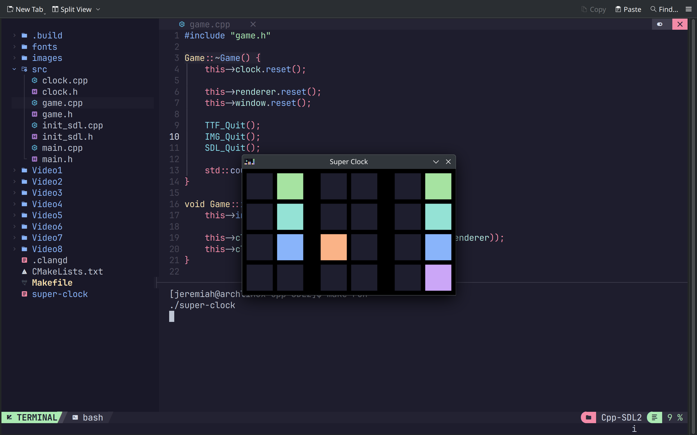

# Super Clock (C++ - SDL2)
A Binary Clock with 3 Layouts, 2 Themes, Color or Black & White and 2 sizes. The Clock displays the Hours, Minutes, and Seconds each as 8 bits.

# ArchLinux instructions.
You will need to make sure SDL2 SDL2_image and SDL2_ttf is installed.
```
sudo pacman -S --needed base-devel sdl2 sdl2_image sdl2_ttf
cd
git clone https://github.com/ProgrammingRainbow/Super-Clock-Cpp-SDL2
cd Super-Clock-Cpp-SDL2
make run
```
# Controls
L/S - Change Layout/Style. \
C - Toggles Color mode. \
B - Toggles Big Mode. \
T - Toggle Text Mode. \
Space - Displays Time in Title for 5 seconds. \
Escape - Close Clock.
